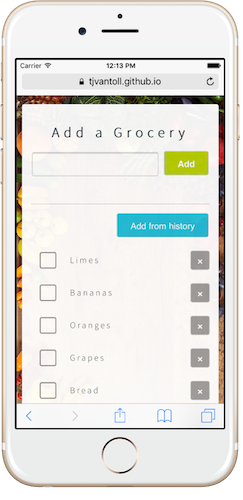

# Groceries

Groceries is a web-based grocery-management app built with Angular 2. The app was built to show how easy Angular 2 makes it to share code across multiple environments.



## Development

To run Groceries you’ll first need to install the Angular 2 CLI installed.

```
npm install -g angular-cli
```

Next, clone this repo.

```
git clone
cd groceries
```

Then, install this app’s dependencies from npm.

```
npm install
```

And finally, use the Angular 2 CLI’s `ng serve` command to see Groceries running in your browser.

```
ng serve
```
